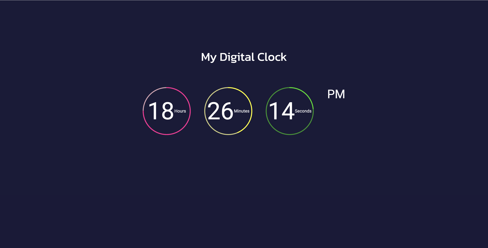

# Digital Clock
> A Simple stylised Digital Clock that shows the time in **hour, minutes, and seconds**.

## General Information
- The clock takes the real-time from the from your time-zone.
- It only serves to provide the time.
- I created such an app as a starting project to verify my skills.

## Technologies Used
- Javascript ECMAScript 2021
- ShoeLace
- HTML and CSS
- Markdown

## Features
- Tells the exact time in *PM* or *AM*

## ScreenShots

## Project Status
Project is: _complete_ but _workInProgress_

## Room for Improvement
Adding new features could give the application more use cases and standout more.

To do:
- A stopwatch.
- Set multiple Alarms.

## Contact
Created by [AkeemBrown](https://www.linkedin.com/in/akeem-brown-92107b22a/) - feel free to contact me on linkedIn.